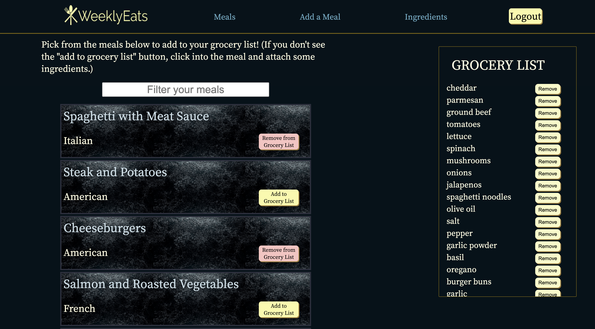
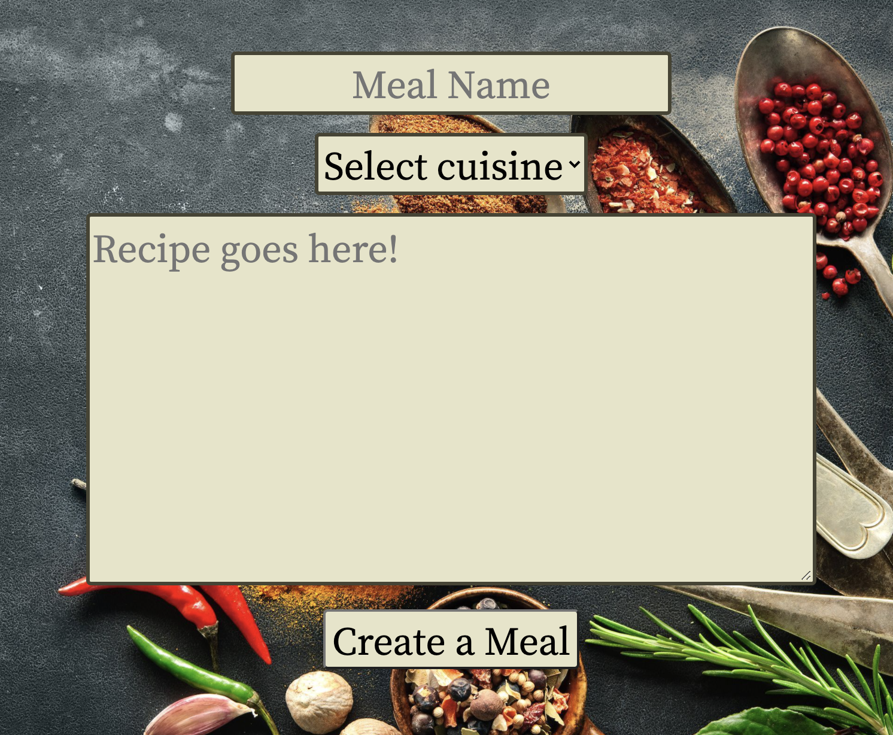
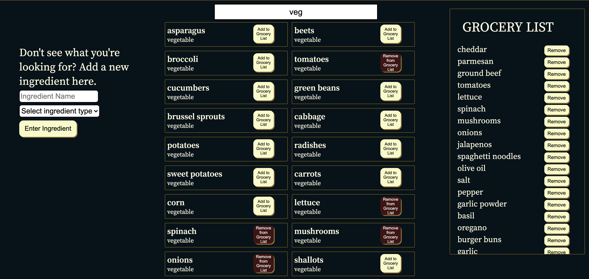
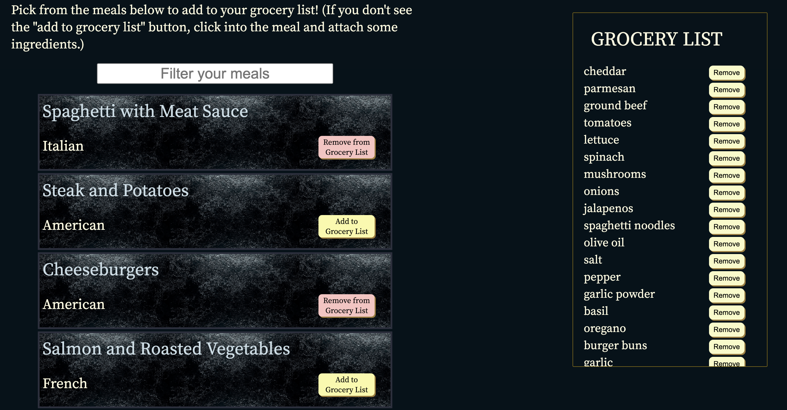

# WeeklyEats


This is an application intended to assist in the process of planning meals and a producing a shopping list for groceries each week.

- Deployed to Heroku: [WeeklyEats](weeklyeats.herokuapp.com)
## Index
- [Backend Routes](https://github.com/ClifDevelops/WeeklyEats/wiki/Back-end-Routes)
- [Frontend Routes](https://github.com/ClifDevelops/WeeklyEats/wiki/Frontend-Routes)
- [MVPs](https://github.com/ClifDevelops/WeeklyEats/wiki/MVPs)


## Technology used
- React
- Redux
- Flask
- Flask-SQLAlchemy
- PostgreSQL
- WTForms
## Features and how to use WeeklyEats
### Meal Creation
- Users have a profile where they can create meals and add ingredients to the meals. These meals serve as the basis for planning what the user will eat in a given week. Meals are editable by the user that created the meal, accessible from the individual meal's page.

### Adding Ingredients to Meals
- To add ingredients to a particular meal, a user goes to the meal's page and can use the form on the right side to attach ingredients. Any ingredient in the database can be added, and if the user doesn't see what they are looking for they can easily add a new ingredient to the database (which will be usable by future users.)


### Searching Ingredients and Adding Ingredients to Database
- Every user has access to a base line of seeded ingredients, and they can search what is available to them on the ingredients page. The ingredients are searchable by name or type. If a user wants to add an ingredient that isn't currently seeded, they are free to do so with the form on the left side of the page (this form is also accessible on each individual meal's page).


### Adding/Removing Ingredients from Grocery List
- Every user will see a grocery list on their home page and on the ingredients page. On the home page they can click the 'Add to Grocery List' button on a particular meal and it will add the associated ingredients to the grocery list. The button will then change to a 'Remove from Grocery List' button, and clicking it will take away those items. One caveat here is that if an ingredient is shared between two or more meals that are included in the grocery list, that ingredient won't be removed unless all the meals are unincluded in the grocery list.
- Individual ingredients can also be added/removed from the grocery list on the ingredients page.


## Some fun bits of code
- One thing that took me a bit to work out was how to keep the appropriate ingredients on the grocery list when utilizing the delete button. Because I'm using Redux to maintain the grocery list, and I was simply using the ingredient id to associate the ingredient to the grocery list, when I used my delete function on an entire meal, it would remove all of its associated ingredients, even if some of those ingredients were associated with other meals that were still on the grocery list.
- The fix happens in the Redux store. Basically, I added an array onto the grocery list that would maintain which meals were being held on the grocery list. When the meal is to be deleted, I first remove the meal from the array:
```bash
case UNSET_MEAL_GL_INGREDIENT:
        const index = state.mealsInGL.indexOf(action.meal.id)
        if (index > -1) {
          state.mealsInGL.splice(index, 1);
        }
```
- Next I run a loop through an array that is keeping track of each ingredient that is associated with the meal. I'm looking to see if that ingredient is associated with any other meals that are still in the grocery list, and if so, do nothing, and if no meals are interested in that ingredient, remove it from the list.
```bash
action.meal.meal_ingredients.forEach((ingredient) => {
         
          if (ingredient.ingredient.meals) {
            let isItTRUE = false;
            ingredient.ingredient.meals.forEach((mealId) => {
            
            if (state.mealsInGL.includes(mealId)) {
              isItTRUE = true;
            }})
            
          if (!isItTRUE) delete state[ingredient.ingredient.id];
          }
          else delete state[ingredient.ingredient.id];
        });
        return { ...state };
```
## Future to-dos
- Sharing meals between users. 
- Using AWS to add images to meals.
- 'Meal spinner' that will suggest a combination of x meals for the week.
- Sorting the grocery list by ingredient type or associated meal.
- Ability to text/email grocery list. 

## Thanks!
- I appreciate you checking out the app. If you have any commentary or are interested in reaching out to me, feel free!
- ClifDevelops@gmail.com

<!-- 
## Getting started

1. Clone this repository (only this branch)

   ```bash
   git clone https://github.com/ClifDevelops/WeeklyEats.git
   ```

2. Install dependencies

      ```bash
      pipenv install --dev -r dev-requirements.txt && pipenv install -r requirements.txt
      ```

3. Create a **.env** file based on the example with proper settings for your
   development environment
4. Setup your PostgreSQL user, password and database and make sure it matches your **.env** file

5. Get into your pipenv, migrate your database, seed your database, and run your flask app

   ```bash
   pipenv shell
   ```

   ```bash
   flask db upgrade
   ```

   ```bash
   flask seed all
   ```

   ```bash
   flask run
   ```

6. To run the React App in development, checkout the [README](./frontend/README.md) inside the `frontend` directory. -->


